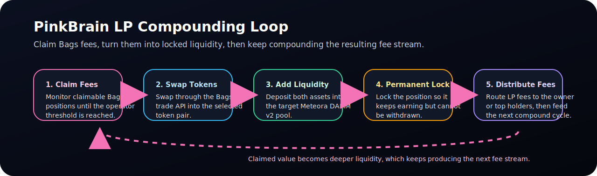
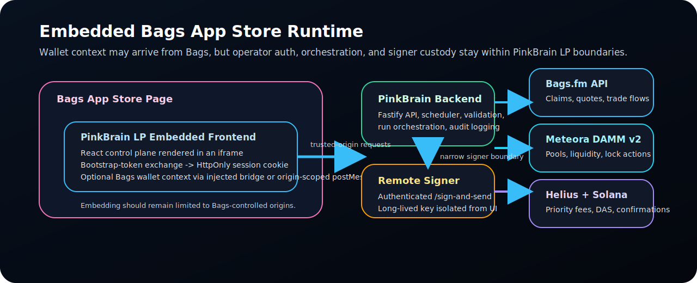

<div align="center">

# PinkBrain LP

### Embedded Bags.fm control plane for permanent, compounding liquidity.

**PinkBrain LP is an operator control plane with Bags App Store embed support that claims Bags.fm fees, swaps into any two SPL tokens, adds Meteora DAMM v2 liquidity, permanently locks the position, and routes LP fees back to the owner or top holders.**

[](https://solana.com/)
[](https://meteora.ag/)
[](https://bags.fm/)
[](https://www.typescriptlang.org/)
[](LICENSE)

[Overview](#overview) | [For Token Creators](#for-token-creators) | [Embedded Runtime](#embedded-runtime) | [Security Model](#security-model) | [Quick Start](#quick-start) | [Operations](#operations)

</div>

---

## Overview

PinkBrain LP exists for one job: turn idle Bags.fm fee income into durable, irreversible on-chain liquidity.

Instead of manually claiming fees and leaving them in a wallet, an operator uses the embedded control plane to:

1. claim Bags.fm fees once they cross a configured threshold
2. swap the proceeds into a chosen SPL token pair
3. add liquidity on Meteora DAMM v2
4. permanently lock the resulting position
5. distribute LP fees to the owner or the top 100 holders
6. repeat on a validated schedule

This repository contains the full operator stack:

- a Fastify backend for strategy orchestration, scheduling, validation, and auditability
- a React frontend that runs standalone in development and can be embedded in the Bags App Store when the host environment supports it
- an isolated remote-signer path so the main backend can avoid holding the long-lived signing key



### Current State

- operator beta: the control plane, backend, auth hardening, and remote-signer path are implemented
- repo verification: `npm run verify` and `npm run lint` should be green before release claims
- known external risk remains: upstream dependency-chain advisories and public Bags embed-contract unknowns are tracked in [docs/known-risks.md](./docs/known-risks.md)

## Why PinkBrain LP

- **Permanent liquidity**: positions are locked on Meteora DAMM v2 and cannot be rugged back out later.
- **Compounding behavior**: claimed fees turn into more liquidity, which produces more fees, which can be compounded again.
- **Embedded operator support**: the control plane can operate inside a Bags App Store iframe without making Bags the source of truth for auth or signing.
- **Operator-safe auth**: the browser exchanges a short-lived bootstrap token for a signed HttpOnly session instead of retaining the long-lived backend bearer token.
- **Verifiable execution**: runs are checkpointed by phase, audit-logged, and confirmed against preserved transaction context.

## For Token Creators

PinkBrain LP is meant to be usable by a token creator who wants durable liquidity, not just by someone reading the source tree all day.

**What you do inside the app:**

1. Open PinkBrain LP from the Bags App Store.
2. Start a secure operator session with a short-lived bootstrap token minted on a trusted machine.
3. Choose your token pair, distribution mode, claim threshold, and schedule.
4. Review inline validation, next-run preview, and strategy insights before saving.
5. Trigger a dry run, inspect the audit trail, then enable live compounding.

**What the system does after that:**

- monitors claimable fee positions
- runs the claim -> swap -> add liquidity -> permanent lock -> distribute pipeline
- records run state, audit events, and operational health
- surfaces next runs, recipient counts, lifetime claimed totals, and recent failures in the embedded UI

## Embedded Runtime

PinkBrain LP is designed for two execution modes:

- **Embedded mode**: a supported deployment path, where the React app runs inside a Bags App Store iframe.
- **Standalone mode**: local development or controlled operator deployments outside the Bags container.

The Bags bridge is optional context support, not the primary auth or signing path:

- if Bags injects `window.bagsAgent`, the app can use it directly for wallet context
- if the app is inside an iframe and a parent origin is configured, it can use a scoped `postMessage` bridge
- if neither is present, the app still works in standalone mode for operator control and testing

The frontend already capability-detects embed mode and never posts to `*`. Transaction execution still remains server-side today, so the embed bridge should be read as wallet-context support rather than proof of a Bags-hosted signing runtime. If you deploy off-origin from the backend, you must align the frontend CSP and trusted origins with the real API host.



### Embedded Deployment Notes

- The frontend is intended to be embedded only by Bags-controlled origins.
- The recommended production layout is same-origin or reverse-proxied so `/api` stays first-party to the embedded app.
- If the frontend and backend are split across origins, the backend session cookie must remain compatible with third-party iframe operation and the frontend CSP `connect-src` must explicitly allow the API origin.
- The browser should never need the raw `API_AUTH_TOKEN` in normal operator use.
- The API and remote signer are not themselves embeddable surfaces; only the static frontend should ever be framed.

See [docs/deploy.md](./docs/deploy.md) for deployment patterns and [frontend/vercel.json](./frontend/vercel.json) for the current frontend embed and CSP policy.

## Security Model

PinkBrain LP hardens the operator path around three boundaries: browser, backend, and signer.

### Browser

- receives a short-lived bootstrap token only during sign-in
- exchanges it for a signed HttpOnly session cookie
- sends an `X-CSRF-Token` on mutating requests
- can run embedded without learning the long-lived backend secret

### Backend

- owns strategy orchestration, scheduling, validation, persistence, and audit logs
- enforces trusted `Origin` checks for cookie-authenticated writes
- exposes only minimal public health data through `GET /api/liveness`
- keeps readiness, stats, strategy mutation, and run control behind authentication

### Signer

- preferred production mode is an isolated remote signer behind an authenticated `/sign-and-send` contract
- break-glass Bags Agent wallet export remains disabled by default
- raw private-key mode is fallback-only for controlled environments

Additional hardening already in this repo:

- strict API security headers
- route-level throttles for auth, strategy mutation, and manual runs
- bigint-safe top-holder distribution math
- transaction confirmation against preserved blockhash context
- governance docs, CodeQL, secret scanning, Dependabot, and branch-check workflows

## What Is Verifiable Today

What this repository can prove directly:

- the backend engine, API, scheduler, validation routes, and audit logging exist here
- the frontend supports secure operator sessions and embedded Bags context detection
- the remote-signer boundary and secret-rotation runbooks are documented here
- `npm run verify` and `npm run lint` are expected to pass in this checkout before release claims are made

What remains environment-specific:

- live on-chain strategy performance
- production explorer links
- production API hostnames and iframe parent origins
- external signer infrastructure beyond this repo
- public confirmation of the Bags iframe contract and `window.bagsAgent` surface

## Quick Start

```bash
git clone https://github.com/kr8tiv-ai/PinkBrain-lp.git
cd PinkBrain-lp
npm install
cp .env.example .env
```

Minimum development setup:

```env
BAGS_API_KEY=your_bags_api_key
HELIUS_API_KEY=your_helius_api_key
API_AUTH_TOKEN=change_me
SESSION_SECRET=change_me_too
BOOTSTRAP_TOKEN_SECRET=change_me
SOLANA_NETWORK=mainnet-beta
FEE_THRESHOLD_SOL=7
NODE_ENV=development
LOG_LEVEL=info
```

Start the stack:

```bash
npm run backend
npm run frontend
```

Mint a local bootstrap token:

```bash
npm run bootstrap-token -w backend -- --frontend-url http://localhost:5173
```

Open the generated link or paste the token into the login gate. The frontend exchanges it through `POST /api/auth/bootstrap/exchange` and then drops the bootstrap token from browser state.

## Production Deployment

The embedded production shape matters as much as the application code.

**Recommended topology**

- static frontend hosted where Bags can embed it
- backend reachable through the same origin or a reverse proxy path like `/api`
- remote signer on an isolated host or private network segment

**Required production secrets**

- `API_AUTH_TOKEN`
- `SESSION_SECRET`
- `BOOTSTRAP_TOKEN_SECRET`
- `REMOTE_SIGNER_URL`
- `REMOTE_SIGNER_AUTH_TOKEN`

**Production cookie posture**

- `__Host-` session cookie
- `Secure`
- `SameSite=None`
- `Partitioned`

Read [docs/deploy.md](./docs/deploy.md) before shipping an embedded deployment. Read [docs/runbook.md](./docs/runbook.md) before operating one.

## API Surface

Public endpoints:

- `GET /api/liveness`
- `GET /api/health`
- `GET /api/auth/session`
- auth bootstrap exchange and logout/login routes

Protected operational endpoints:

- `GET /api/readiness`
- `GET /api/stats`
- `GET /api/strategies/insights`
- `GET /api/strategies/:id/insights`
- validation endpoints
- strategy CRUD, run control, pause/resume, logs, and retry routes

## Repository Structure

```text
PinkBrain-lp/
  backend/
    src/
      api/              Fastify server, auth, rate limits, headers
      clients/          Bags, Meteora, Helius integrations
      engine/           Phase pipeline and resumable runs
      services/         auth, validation, strategy insights, remote signer
      tests/            backend unit and integration coverage
  frontend/
    src/
      api/              session-aware API client
      components/       login gate, layout, shared UI
      hooks/            Bags embed detection and bridge logic
      pages/            dashboard, create strategy, strategy detail
  docs/
    runbook.md
    deploy.md
    dependency-audit.md
    operations/
```

## Operations

Primary operational docs:

- [docs/runbook.md](./docs/runbook.md)
- [docs/deploy.md](./docs/deploy.md)
- [docs/dependency-audit.md](./docs/dependency-audit.md)
- [docs/operations/remote-signer.md](./docs/operations/remote-signer.md)
- [docs/operations/secret-rotation.md](./docs/operations/secret-rotation.md)
- [PRD.md](./PRD.md)

Useful commands:

```bash
npm run verify
npm run lint
npm run remote-signer -w backend
npm run bootstrap-token -w backend -- --frontend-url https://your-embedded-app.example
```

## Current Status

Repository status as of the current implementation:

- core product: implemented
- embedded operator UI: implemented
- remote signer path: implemented
- auth/session hardening: implemented
- bigint-safe distribution and blockhash-safe confirmation: implemented
- remaining work: live environment validation, signer infrastructure outside the repo, and upstream dependency churn in third-party SDK chains

## Links

- [Bags.fm](https://bags.fm)
- [Meteora Docs](https://docs.meteora.ag)
- [Helius Docs](https://docs.helius.dev)
- [Solana Docs](https://solana.com/docs)

## License

MIT -- see [LICENSE](LICENSE).

---

<div align="center">

**PinkBrain LP** -- permanent liquidity, embedded operator control, and compounding fee infrastructure for Bags.fm.

Built by [kr8tiv.ai](https://github.com/kr8tiv-ai)

</div>
